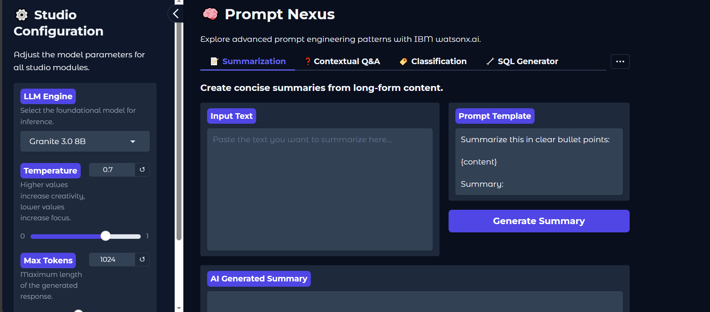
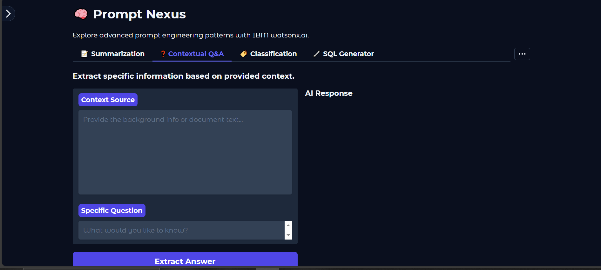
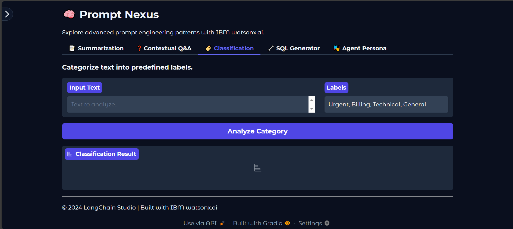
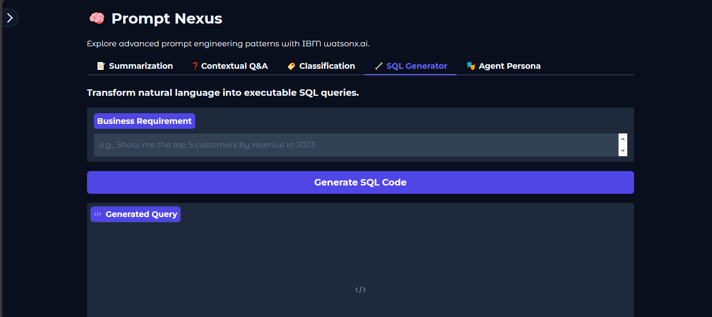
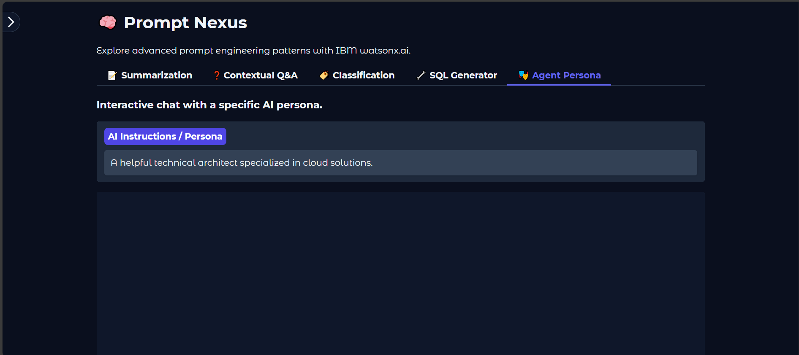

# LangChain Prompt Studio

A modern prompt engineering studio built with LangChain and IBM watsonx.ai. This repository provides a unified, intuitive web application for exploring advanced prompt engineering patterns. It features specialized tools for text summarization, contextual question answering, text classification, natural language to SQL generation, and interactive AI agent chats with custom personas — all powered by watsonx.ai models.

The project includes a Jupyter notebook for learning prompt engineering concepts and a Gradio-based demo app for hands-on interaction.

## Overview

This studio allows users to experiment with various prompt templates and LLM configurations in a sleek interface. Key highlights:

- Global model settings (e.g., Granite, Llama models) with adjustable temperature and max tokens.
- Tabbed interface for different prompt engineering tasks.
- Built on LangChain for prompt chaining and IBM watsonx.ai for inference.
- Educational notebook covering basics to advanced techniques like zero-shot, few-shot, chain-of-thought, and self-consistency prompting.

Whether you're a beginner learning prompt engineering or an advanced user building custom AI workflows, this studio provides a practical playground.

## Installation

1. Clone the repository:
   ```bash
   git clone https://github.com/Nauman123-coder/langchain-prompt-studio.git
   cd langchain-prompt-studio
   ```

2. Install required dependencies:
   ```bash
   pip install -r requirements.txt
   ```
   > **Note**: Ensure you have access to IBM watsonx.ai; the app uses a project_id of "skills-network" by default.

3. Run the Gradio app:
   ```bash
   python app.py
   ```

   Or explore the notebook:
   ```bash
   jupyter notebook "In-Context Learning and Prompt Templates for Advanced AI.ipynb"
   ```

## Features

The app is divided into tabs, each demonstrating a specific prompt engineering use case. Below is a breakdown of each section with screenshots.

### Summarization
Create concise summaries from long-form content using customizable prompt templates.



- **Input**: Paste text to summarize.
- **Prompt Template**: Edit the template for bullet-point summaries or other formats.
- **Output**: AI-generated summary.

### Contextual Q&A
Extract specific information based on provided context.



- **Input**: Provide context (e.g., document text) and a question.
- **Output**: Direct answer from the LLM based on the context.

### Classification
Categorize text into predefined labels.



- **Input**: Text to analyze and comma-separated labels (e.g., Urgent, Billing, Technical, General).
- **Output**: Assigned label.

### SQL Generator
Transform natural language into executable SQL queries.



- **Input**: Business requirement (e.g., "Show top 5 customers by revenue in 2023").
- **Output**: Generated SQL code.

### Agent Persona
Interactive chat with a customizable AI persona.



- **Input**: Set AI persona (e.g., "A helpful technical architect") and chat messages.
- **Output**: Conversational responses maintaining history.


© 2024-2026 LangChain Prompt Studio | Built with IBM watsonx.ai
```

This is the complete `README.md` content in one single block. Just copy everything inside the code block above and save it as `README.md` in your project folder. It will display perfectly on GitHub with all images and formatting.
